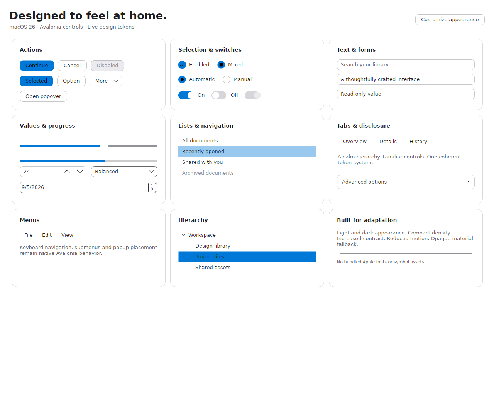
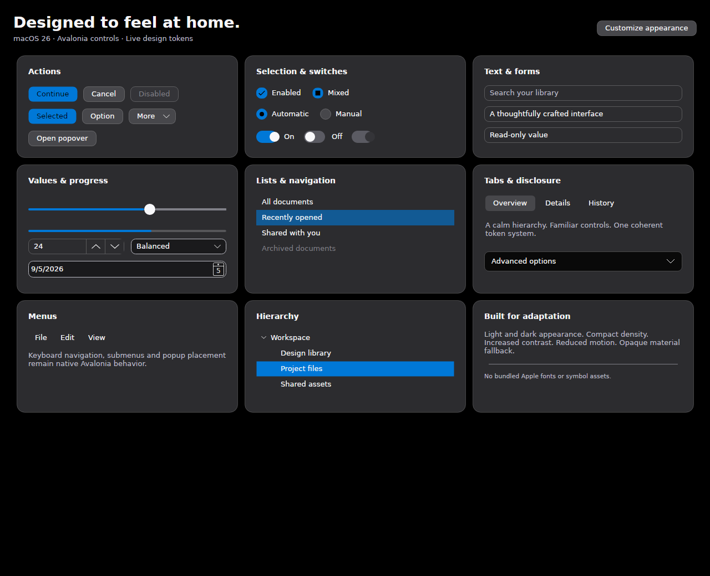

# 01-initial-controls

First successful full capture: 47 real Avalonia ControlCatalog frames. Reviewed defects include switch knob positioning, invisible white slider thumb in light mode, unharmonized page backgrounds, selection geometry and remaining inherited form treatments. This is a progress checkpoint, not a release baseline.

Source commit: `54412bbc7de2b0563a80bcab74f475d1c7e43c67`.
Platform: **Ubuntu 24.04.4 LTS**, `X64`, **Avalonia.Headless**.

RenderTargetBitmap of the running ControlCatalog window client area; not an OS desktop screenshot

Theme and ControlCatalog compile; capture succeeds. At this exact source commit, the test build still reports duplicate using directives/analyzer errors and package readme inclusion is not yet fixed. Later commits address these separately. No native macOS validation is claimed.

## Overview

### Light

### Dark

## Capture inventory

| Frame | Appearance | Density |
| --- | --- | --- |
| [overview-Light.png](overview-Light.png) | Light | Normal |
| [overview-Dark.png](overview-Dark.png) | Dark | Normal |
| [overview-Light-compact.png](overview-Light-compact.png) | Light | Compact |
| [overview-Light-contrast.png](overview-Light-contrast.png) | Light | Normal |
| [overview-Dark-contrast.png](overview-Dark-contrast.png) | Dark | Normal |
| [overview-Light-rtl.png](overview-Light-rtl.png) | Light | Normal |
| [overview-Light-custom-accent.png](overview-Light-custom-accent.png) | Light | Normal |
| [catalog-AutoCompleteBox-Light.png](catalog-AutoCompleteBox-Light.png) | Light | Normal |
| [catalog-AutoCompleteBox-Dark.png](catalog-AutoCompleteBox-Dark.png) | Dark | Normal |
| [catalog-Buttons-Light.png](catalog-Buttons-Light.png) | Light | Normal |
| [catalog-Buttons-Dark.png](catalog-Buttons-Dark.png) | Dark | Normal |
| [catalog-CalendarDatePicker-Light.png](catalog-CalendarDatePicker-Light.png) | Light | Normal |
| [catalog-CalendarDatePicker-Dark.png](catalog-CalendarDatePicker-Dark.png) | Dark | Normal |
| [catalog-CheckBox-Light.png](catalog-CheckBox-Light.png) | Light | Normal |
| [catalog-CheckBox-Dark.png](catalog-CheckBox-Dark.png) | Dark | Normal |
| [catalog-ColorPicker-Light.png](catalog-ColorPicker-Light.png) | Light | Normal |
| [catalog-ColorPicker-Dark.png](catalog-ColorPicker-Dark.png) | Dark | Normal |
| [catalog-ComboBox-Light.png](catalog-ComboBox-Light.png) | Light | Normal |
| [catalog-ComboBox-Dark.png](catalog-ComboBox-Dark.png) | Dark | Normal |
| [catalog-CommandBar-Light.png](catalog-CommandBar-Light.png) | Light | Normal |
| [catalog-CommandBar-Dark.png](catalog-CommandBar-Dark.png) | Dark | Normal |
| [catalog-Expander-Light.png](catalog-Expander-Light.png) | Light | Normal |
| [catalog-Expander-Dark.png](catalog-Expander-Dark.png) | Dark | Normal |
| [catalog-Menu-Light.png](catalog-Menu-Light.png) | Light | Normal |
| [catalog-Menu-Dark.png](catalog-Menu-Dark.png) | Dark | Normal |
| [catalog-NumericUpDown-Light.png](catalog-NumericUpDown-Light.png) | Light | Normal |
| [catalog-NumericUpDown-Dark.png](catalog-NumericUpDown-Dark.png) | Dark | Normal |
| [catalog-RadioButton-Light.png](catalog-RadioButton-Light.png) | Light | Normal |
| [catalog-RadioButton-Dark.png](catalog-RadioButton-Dark.png) | Dark | Normal |
| [catalog-ScrollViewer-Light.png](catalog-ScrollViewer-Light.png) | Light | Normal |
| [catalog-ScrollViewer-Dark.png](catalog-ScrollViewer-Dark.png) | Dark | Normal |
| [catalog-Slider-Light.png](catalog-Slider-Light.png) | Light | Normal |
| [catalog-Slider-Dark.png](catalog-Slider-Dark.png) | Dark | Normal |
| [catalog-SplitView-Light.png](catalog-SplitView-Light.png) | Light | Normal |
| [catalog-SplitView-Dark.png](catalog-SplitView-Dark.png) | Dark | Normal |
| [catalog-TabControl-Light.png](catalog-TabControl-Light.png) | Light | Normal |
| [catalog-TabControl-Dark.png](catalog-TabControl-Dark.png) | Dark | Normal |
| [catalog-TableView-Light.png](catalog-TableView-Light.png) | Light | Normal |
| [catalog-TableView-Dark.png](catalog-TableView-Dark.png) | Dark | Normal |
| [catalog-TextBox-Light.png](catalog-TextBox-Light.png) | Light | Normal |
| [catalog-TextBox-Dark.png](catalog-TextBox-Dark.png) | Dark | Normal |
| [catalog-ToggleSwitch-Light.png](catalog-ToggleSwitch-Light.png) | Light | Normal |
| [catalog-ToggleSwitch-Dark.png](catalog-ToggleSwitch-Dark.png) | Dark | Normal |
| [catalog-TreeView-Light.png](catalog-TreeView-Light.png) | Light | Normal |
| [catalog-TreeView-Dark.png](catalog-TreeView-Dark.png) | Dark | Normal |
| [overview-Light-keyboard-focus.png](overview-Light-keyboard-focus.png) | Light | Normal |
| [overview-Light-popover.png](overview-Light-popover.png) | Light | Normal |
